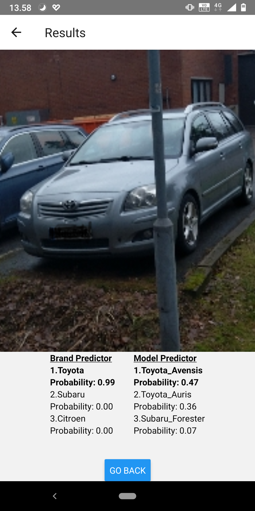
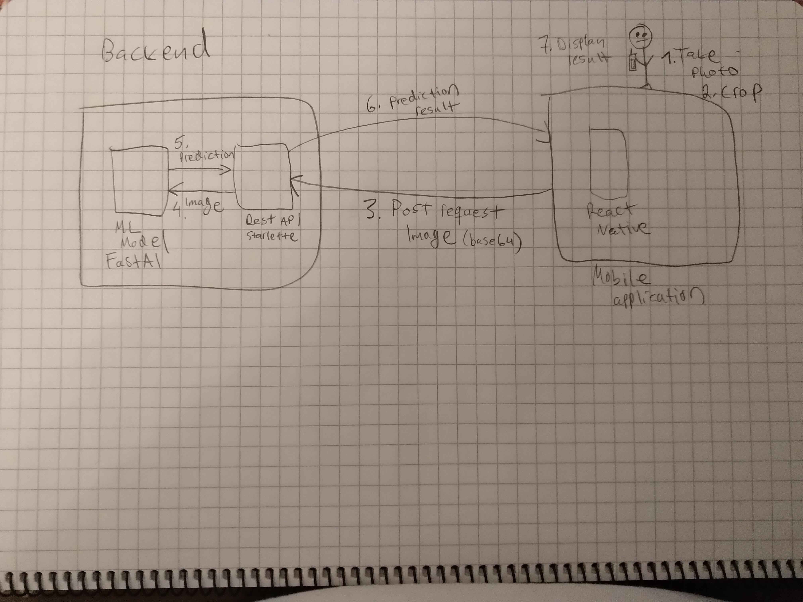

# CarCollectorApp
Detecting car model made easy with the help of deep learning.

[Backend](https://github.com/JoonasMaanonen/car_collector_backend)

## Why I did this project
While I have some Machine learning experience from Kaggle competitions, this does not teach you some of the crucial skills that are needed in real deep learning applications such as inference, collecting data, cleaning data and many more important skills.

I chose a mobile application as this would allow me to test my application in the real world, which was very motivating and fun. It also helps to develop an intuition about what features
neural networks actually learn, since you can take multiple pictures of the same object from different angles and see how it affects the prediction accuracy. 

## What I did in the project
- Collected a dataset of car images via Google search and crawling [autoscout24](https://www.autoscout24.com).
- Trained a ResNet50 model to predict the model of the car.
- Created a REST API to serve this deep learning model.
- Served this API inside a docker container in render.com
- Created a mobile app with react native, which can be used to take photos of cars and predict the cars' model.

## Architecture

## Typical program flow
    1. User takes an image with the mobile application.
    2. User crops out unnecesary stuff from it image with the popup cropping tool.
    3. The mobile app sends a POST request with the image to the backend server.
    4. The backend server uses the trained deep learning model to do inference on the new photo.
    5. Backend application sends the result of this inference back to the mobile application.
    6. User gets to know the model of his/her car.

## What I learned during the project
First time I trained the model and got very nice validation accuracy and was excited about going to try my app in the real world. To my dissapointment it did not work at all and I started to wonder why. I tried tuning bunch things in the deep learning side but then realized that I had
not once checked how the image looks like before the model does inference on it.

After a building a debug page that would display the images sent to the server the issue was glaring. My camera had a resolution of 3024x4032 and then this image would get resized to 224x224 for the neural network model. When I took photos of the cars they were maybe 1/4 of the camera window and then when they got resized to 224x224 the actual car was unidentifiable mess, therefore the model would make quite random predictions as there were no features corresponding to the learned ones. This issue was fixed by adding cropping functionality, so that the user could crop the relevant part of the image. Lesson learned from all this hassle was that you should always check what the input looks like when doing inference. 

This was also the first time I have built and react native mobile application. I chose React-native as I had some experience with React before and I did not want to learn Android programming as this projects' main scope was learning about deep learning not mobile development. I found react-native quite easy to learn, granted my application is probably quite terrible compared to ones built by people actually know what they are doing. I am still very satisfied with the app as it serves my purpose of learning about deep learning perfectly. 

